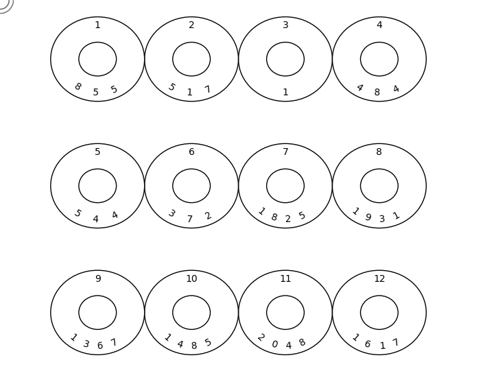

# BIP39 Output Generator

This Python script generates BIP39 output indexes from a given seed phrase.
These index numbers can then be stamped into stainless steel washers as a way to store your seed phrase that is safe from fire corrosion and floods.
The following two YouTube videos give you examples on how to create your own. These examples stamp the Seed phrase Word into the washer.
This can be very time-consuming for long words. This script converts your words into the bip39 index number so you can just stamp the number.
Add an extra layer of security as many people wouldn't know What a bunch of washers and numbers are
https://youtu.be/EEyz7p9Aci8?si=DTWno46ocGE5nzQa
https://youtu.be/3Aj_EHOu9WE?si=VRtZhSvuVW5_wwhU
It runs 100% locally and does not access the Internet.
**CAUTION!** Never enter your seed phrase into a webpage online. You can never trust where the information is going.

## link to 3-D printable washer stamp jig
https://www.thingiverse.com/thing:4590734

## Does my wallet support bip39?
If you use any of the following wallets then they support bip39 seed phrases.There are a lot more just do your own research.

## Hardware Wallets	Website
Ledger	https://www.ledger.com/   
Trezor	https://trezor.io/  
Keepkey	https://shapeshift.com/keepkey   
Bit Box	https://shiftcrypto.ch/   
Cool Wallet	https://www.coolwallet.io/   
Cobo Vault	https://cobo.com/hardware-wallet/cobo-vault   
Cold Card Wallet	https://coldcardwallet.com/   
Ellipal	https://www.ellipal.com/   

## Software Wallets (Desktop)	Website
Electrum	https://electrum.org/   
Jaxx (Desktop / Mobile)	https://jaxx.io/   
Coinomi (Desktop / Mobile)	https://coinomi.com/   
Atomic Cryptocurrency Wallet (Desktop / Mobile)	https://atomicwallet.io/   
Bither (Desktop / Mobile)	https://bither.net/   
Exodus	https://www.exodus.io/   
Samourai Wallet (Desktop / Mobile)	https://samouraiwallet.com/   
Coin Wallet (Desktop / Mobile)	https://coin.space/   
Blockstream Green (Desktop / Mobile)	https://blockstream.com/green/   
Wasabi Wallet (Desktop / Mobile)	https://wasabiwallet.io/   

## Mobile Wallets (Android / IOS)	Website
Bread Wallet	https://brd.com/   
Mycelium Wallet	https://wallet.mycelium.com/   
Eidoo (Desktop / Mobile)	https://eidoo.io/   
Ownbit	https://ownbit.io/en/   
Blue Wallet	https://bluewallet.io/   
Enjin Wallet	https://enjin.io/wallet   

## Web Wallets	Website
Blockchain Wallet	https://www.blockchain.com/wallet   
My Crypto Wallet	https://mycrypto.com/account   
My Ether Wallet	https://www.myetherwallet.com/   

## Prerequisites

Before you begin, ensure you have met the following requirements:

* You have installed Python 3.6 or later.

## Installing Python

### Windows

1. Visit the official Python website at https://www.python.org/.
2. Hover over the 'Downloads' tab and click on 'Windows'.
3. Click on the latest Python release. As of writing these instructions, Python 3.12.1 is the latest version.
4. After downloading the executable, run it. In the first screen of the installation wizard, check the box that says 'Add Python 3.9 to PATH' and then click 'Install Now'.
5. Once the installation is complete, you can verify the installation by opening a new command prompt window and typing `python --version`. You should see `Python 3.9.7`.

### macOS

1. Visit the official Python website at https://www.python.org/.
2. Hover over the 'Downloads' tab and click on 'macOS'.
3. Click on the latest Python release. As of writing these instructions, Python 3.12.1 is the latest version.
4. After downloading the package, run it and follow the instructions in the installation wizard.
5. Once the installation is complete, you can verify the installation by opening a new terminal window and typing `python3 --version`. You should see `Python 3.9.7`.

* You have installed the following Python libraries:
  * `os`
  * `json`
  * `random`
  * `matplotlib`
  * `numpy`

You can install any missing libraries with pip:

pip install matplotlib numpy

## Installing BIP39 Output Generator

To install BIP39 Output Generator, follow these steps:

1. Clone the repository:

git clone https://github.com/yourusername/bip39output.git

2. Navigate to the project directory:

cd bip39output

## Using BIP39 Output Generator

To use BIP39 Output Generator, follow these steps:

### 1. Run the script:

python getNumbersfromSeed.py

### 2. If you have not hardcoded your seed phrase in the script, you will be prompted to enter it as follows:

~/Documents/Python code/bip39 /opt/homebrew/bin/python3 "/Users/<user>/Documents/Python code/bip39/getNumbersfromSeed.py"  

Please enter 12 words: hello dog abandon detect dumb common tomato vanish print ridge zoo skate  

1 - 'hello' : 855  
2 - 'dog' : 517  
3 - 'abandon' : 1  
4 - 'detect' : 484  
5 - 'dumb' : 544  
6 - 'common' : 372  
7 - 'tomato' : 1825  
8 - 'vanish' : 1931  
9 - 'print' : 1367  
10 - 'ridge' : 1485  
11 - 'zoo' : 2048  
12 - 'skate' : 1617  
[855, 517, 1, 484, 544, 372, 1825, 1931, 1367, 1485, 2048, 1617] . 

### 3. If you Run the script with the test hardcoded seed you will get the following output:

~/Documents/Python code/bip39 /opt/homebrew/bin/python3 "/Users/<user>/Documents/Python code/bip39/getNumbersfromSeed.py"   
 1 - 'hello' : 855   
 2 - 'dog' : 517    
 3 - 'abandon' : 1    
 4 - 'detect' : 484   
 5 - 'dumb' : 544   
 6 - 'common' : 372   
 7 - 'tomato' : 1825   
 8 - 'vanish' : 1931   
 9 - 'print' : 1367   
 10 - 'ridge' : 1485   
 11 - 'zoo' : 2048   
 12 - 'skate' : 1617   
[855, 517, 1, 484, 544, 372, 1825, 1931, 1367, 1485, 2048, 1617] . 

 

### 4. When you need to get your seed phrase back run the script getSeedfromNumbers.py

python getSeedfromNumbers.py

input 12 numbers from your stainless steel washers that correspond to words in the bip39 word#list 
The App Will look them up in A local copy of the bip39 wordlist to find the corresponding words. It will then Print the words and their index numbers.
It does this all locally , not on the web. **CAUTION!** Never enter your seed phrase into any website or app that is connected to the Internet
The example below is what you get if you use the test seed phrase. Comment the line in the script to enter your own Numbers.  

~/Documents/Python code/bip39 /opt/homebrew/bin/python3 "/Users/<user>/Documents/Python code/bip39/getSeedfromNumbers.py"  
Index 1: '855' corresponds to the word 'hello' in the bip39 wordlist  
Index 2: '517' corresponds to the word 'dog' in the bip39 wordlist.  
Index 3: '1' corresponds to the word 'abandon' in the bip39 wordlist.  
Index 4: '484' corresponds to the word 'detect' in the bip39 wordlist.  
Index 5: '544' corresponds to the word 'dumb' in the bip39 wordlist.  
Index 6: '372' corresponds to the word 'common' in the bip39 wordlist.  
Index 7: '1825' corresponds to the word 'tomato' in the bip39 wordlist.  
Index 8: '1931' corresponds to the word 'vanish' in the bip39 wordlist.  
Index 9: '1367' corresponds to the word 'print' in the bip39 wordlist.  
Index 10: '1485' corresponds to the word 'ridge' in the bip39 wordlist.  
Index 11: '2048' corresponds to the word 'zoo' in the bip39 wordlist.  
Index 12: '1617' corresponds to the word 'skate' in the bip39 wordlist.  
[855, 517, 1, 484, 544, 372, 1825, 1931, 1367, 1485, 2048, 1617] . 

Entering your own Index numbers Will look like the following;

~/Documents/Python code/bip39 /opt/homebrew/bin/python3 "/Users/<users>/Documents/Python code/bip39/getSeedfromNumbers.py"

Please enter 12 Numbers in the correct order: 855 517 1 484 544 372 1825 1931 1367 1485 2048 1617  

Index 1: '855' corresponds to the word 'hello' in the bip39 wordlist.  
Index 2: '517' corresponds to the word 'dog' in the bip39 wordlist.  
Index 3: '1' corresponds to the word 'abandon' in the bip39 wordlist.  
Index 4: '484' corresponds to the word 'detect' in the bip39 wordlist.  
Index 5: '544' corresponds to the word 'dumb' in the bip39 wordlist.  
Index 6: '372' corresponds to the word 'common' in the bip39 wordlist.  
Index 7: '1825' corresponds to the word 'tomato' in the bip39 wordlist.  
Index 8: '1931' corresponds to the word 'vanish' in the bip39 wordlist.  
Index 9: '1367' corresponds to the word 'print' in the bip39 wordlist.  
Index 10: '1485' corresponds to the word 'ridge' in the bip39 wordlist.  
Index 11: '2048' corresponds to the word 'zoo' in the bip39 wordlist.  
Index 12: '1617' corresponds to the word 'skate' in the bip39 wordlist.  
[855, 517, 1, 484, 544, 372, 1825, 1931, 1367, 1485, 2048, 1617]  

## Contributions/Bugs
If you notice any bugs, please report it by opening an issue.

If you want to contribute code, you are welcome to do so .

## License

This project uses the following license: `<Apache License 2.0>`.

